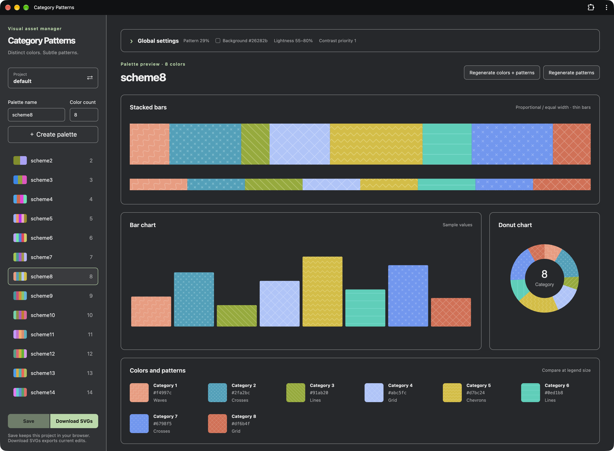
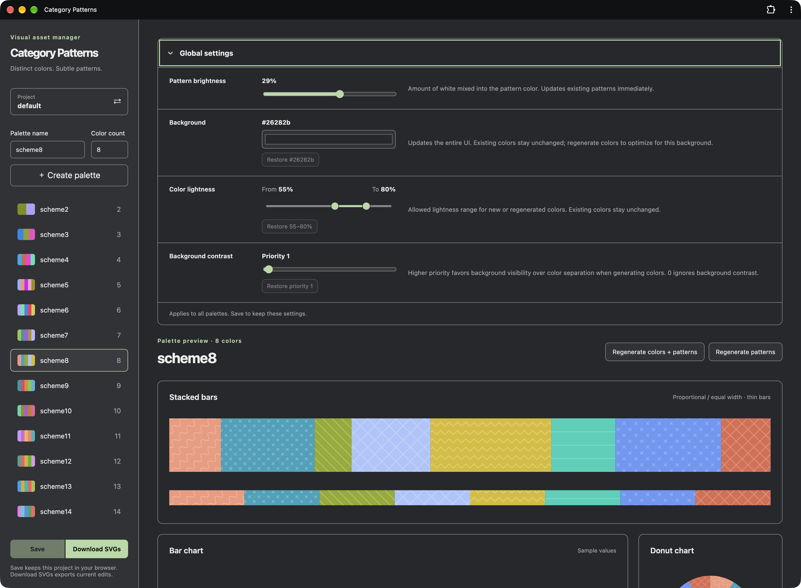
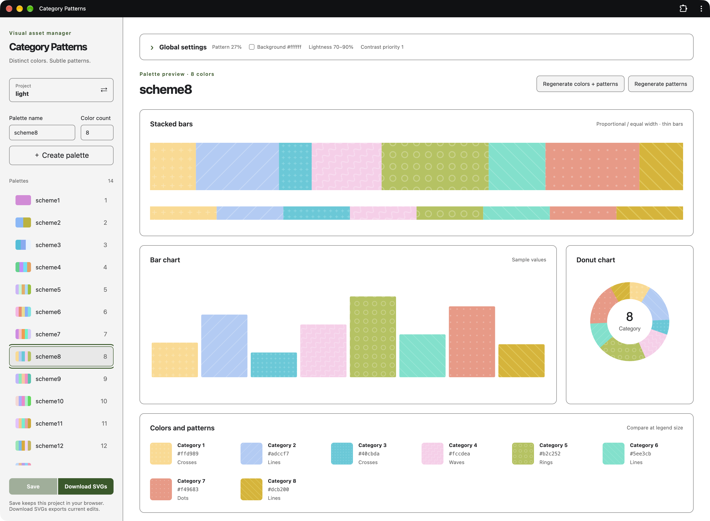

# Category Patterns

차트와 카테고리 라벨에 사용할 색상 팔레트와 은은한 패턴을 만드는 앱입니다.
막대·누적 막대·도넛 차트로 비교하고, 프로젝트에 사용할 SVG 파일로 내보낼 수 있습니다.

**[웹앱 열기](https://iamssen.github.io/category-patterns/)** · [English](README.md)



## 만들고 조정하기

- 필요한 색상 개수로 팔레트를 만듭니다. 색상과 패턴을 함께 다시 생성하거나 패턴만 바꿀 수 있습니다.
- **Create palette** 옆 옵션 버튼에서 원하는 순서의 HEX 색상 1~20개로 팔레트를 만듭니다. 공백·탭·줄바꿈 또는 쉼표·따옴표·괄호 등의 기호로 구분하며, `#RGB`와 `#RRGGBB` 형식에서 `#`는 생략할 수 있습니다.
- 색상 미리보기·HEX 값·카테고리·패턴 이름을 누르면 편집 패널에서 바로 조정할 수 있습니다. 패널에서 색상과 패턴을 무작위로 바꾸고, 색상 순서를 옮기거나 HEX를 복사할 수 있습니다. 각도·간격·두께는 슬라이더나 숫자로 조정합니다.
- Undo/Redo 버튼이나 ⌘/Ctrl Z, ⌘/Ctrl Shift Z로 편집·재생성·순서 변경·삭제를 되돌립니다. 편집 화면을 떠나면 이력이 초기화되며, 텍스트 입력란은 일반적인 실행 취소 동작을 유지합니다.
- 패턴 밝기와 배경색, 새로 생성할 색상의 명도와 대비를 조정합니다.
- Global settings에서 패턴 간격과 두께의 최소·최대 값을 지정해 무작위 생성 범위를 제한합니다. 두 값을 같게 하면 고정되며, 기존 패턴은 유지됩니다.
- Dark 또는 Light 샘플로 프로젝트를 만들고 따로 관리합니다. **Project** 버튼에서 프로젝트를 전환하거나 생성해 주세요. 현재 브라우저 세션에서 마지막으로 선택한 팔레트와 Global settings 펼침 상태를 기억합니다.



사용할 UI에 맞는 배경색으로 팔레트를 미리 볼 수 있습니다. 배경을 바꾸어도
기존 팔레트 색상은 유지됩니다. 새 배경에 맞추려면 색상을 다시 생성해 주세요.



## 저장하고 다운로드하기

**Save**는 프로젝트와 설정을 현재 브라우저에 저장합니다. **Download SVGs**는
프로젝트를 저장하지 않고 현재 편집 내용을 ZIP으로 내보냅니다. ZIP에는 팔레트 SVG와
CSS 배경에 사용할 개별 패턴 SVG가 포함됩니다.

브라우저 앱 메뉴나 **홈 화면에 추가**로 웹앱을 설치할 수 있습니다.
온라인에서 한 번 열면 오프라인에서도 편집과 SVG 다운로드를 사용할 수 있습니다.
새 버전이 있으면 **Refresh app**을 눌러 업데이트할 수 있습니다.
저장하지 않은 변경 사항이 있으면 저장한 후 새로고침합니다.

## Local App 사용하기

앱을 로컬에서 실행하면 지정한 폴더에 SVG 파일을 직접 생성할 수 있습니다.
여러 출력 폴더도 지정할 수 있어, 매번 ZIP을 풀지 않고 프로젝트의 에셋을 갱신할 수 있습니다.
Local App은 로컬 서버를 실행하고 브라우저에서 사용하는 방식입니다.

[Node.js](https://nodejs.org/) 22.12 이상을 설치한 뒤 실행해 주세요.

```sh
git clone https://github.com/iamssen/category-patterns.git
cd category-patterns
npm install
npm run dev:app
```

터미널에 표시되는 로컬 주소(일반적으로 `http://127.0.0.1:5174`)를 열어 주세요.
앱을 사용하는 동안 서버를 실행해 두세요.

1. **Project**에서 프로젝트를 만들거나 출력 경로를 수정합니다.
2. `~/my-project/public/category-patterns`처럼 한 줄에 한 SVG 출력 폴더를 입력합니다.
3. 프로젝트를 열고 **Generate SVGs**를 누르면 현재 편집 내용으로 SVG 파일을 생성합니다.

**Save**는 프로젝트를 `~/category-patterns/{name}.yml`에 저장합니다.
**Generate SVGs**는 SVG 파일을 별도로 생성하므로, 편집 내용을 유지하려면 저장도 해 주세요.
출력 폴더는 프로젝트 저장 폴더와 분리해야 하며, 프로젝트끼리 공유하거나 중첩할 수 없습니다.
SVG 에셋 전용 폴더를 사용해 주세요.

프로젝트를 만들 때 **Include palettes**를 해제하면 선택한 Dark/Light 설정으로
팔레트 없는 프로젝트를 시작할 수 있습니다.

프로젝트 카드의 **Export project**로 저장된 프로젝트를 `{name}.category-patterns.svg` 파일로
내보낼 수 있습니다. SVG에는 팔레트 미리보기와 복원용 프로젝트 데이터가 포함됩니다.
프로젝트 카드는 저장된 데이터를 내보냅니다. 편집 화면의 **Project actions → Export project**는 저장하지 않고 현재 편집 내용을 내보냅니다.
웹과 로컬 App의 **Import project**에서 `.category-patterns.svg` 프로젝트 파일 하나를 가져올 수 있습니다.
같은 이름이 있으면 숫자를 붙여 새 프로젝트로 저장하며, 출력 폴더는 공유 파일에서 제외합니다.
미리보기의 텍스트 색상은 App처럼 프로젝트 배경에 맞춰 바뀝니다.
이미지 변환이나 SVG 최적화 과정에서 프로젝트 데이터가 없어질 수 있으니 원본 SVG를 공유해 주세요.

**Delete**는 프로젝트가 두 개 이상일 때 확인 후 삭제합니다. `default`도 삭제할 수
있으며, 마지막 프로젝트 하나는 유지합니다.
로컬 App에서 생성한 SVG와 생성 이력은 남아 출력 폴더를 계속 보호합니다.
새 프로젝트에는 다른 이름과 출력 폴더를 사용해 주세요.

## React에서 SVG 사용하기

Vite 프로젝트의 `public/category-patterns/`에 생성한 SVG 파일과 `colors.json`을 넣어 주세요.
`fill("scheme8", 2)` 또는 `backgroundImage("scheme8", 2)`에 팔레트 이름과
패턴 인덱스를 전달합니다. 아래 예제는 `scheme8.svg`와 `scheme8.fill2.svg`를 사용하며,
인덱스는 1부터 시작합니다. `color("scheme8", 2)`는 `fill2`의 원래 바탕색을 반환합니다.

```jsx
// CategoryPatterns.jsx
import { createContext, useContext, useEffect, useRef, useState } from "react";

const PatternContext = createContext(null);

export function CategoryPatternsProvider({ children }) {
  const container = useRef(null);
  const requested = useRef(new Set());
  const [colors, setColors] = useState({});

  useEffect(() => {
    const controller = new AbortController();
    async function loadColors() {
      const response = await fetch("/category-patterns/colors.json", {
        signal: controller.signal,
      });
      if (!response.ok) throw new Error(`Colors request failed: ${response.status}`);
      setColors(await response.json());
    }
    loadColors().catch((error) => {
      if (error.name !== "AbortError") console.error(error);
    });
    return () => controller.abort();
  }, []);

  async function load(scheme) {
    if (requested.current.has(scheme)) return;
    requested.current.add(scheme);
    const response = await fetch(`/category-patterns/${scheme}.svg`);
    if (!response.ok) throw new Error(`SVG request failed: ${response.status}`);
    const source = await response.text();
    const svg = new DOMParser().parseFromString(source, "image/svg+xml");
    container.current?.append(document.importNode(svg.documentElement, true));
  }

  const patterns = {
    color: (scheme, index) => colors[scheme]?.[index - 1],
    fill(scheme, index) {
      // Safari does not support external SVG pattern fills such as
      // url("/category-patterns/scheme8.svg#scheme8-fill2"); inject the SVG and use a local ID.
      load(scheme).catch(console.error);
      return `url("#${scheme}-fill${index}")`;
    },
    backgroundImage: (scheme, index) =>
      `url("/category-patterns/${scheme}.fill${index}.svg")`,
  };

  return (
    <PatternContext.Provider value={patterns}>
      <div ref={container} aria-hidden="true"
        style={{ position: "absolute", width: 0, height: 0, overflow: "hidden" }} />
      {children}
    </PatternContext.Provider>
  );
}

export function useCategoryPatterns() {
  return useContext(PatternContext);
}
```
앱을 Provider로 한 번 감싸 주세요. `fill`은 필요한 팔레트 SVG를 한 번씩 불러오고
같은 문서의 패턴 참조를 반환합니다. `backgroundImage`는 개별 SVG 파일의 URL을 반환합니다.
`color`는 `colors.json`을 불러오기 전이나 팔레트 또는 fill이 없을 때 `undefined`를 반환합니다.
반환된 HEX 색상의 밝기를 변형해 라인색으로 사용할 수 있습니다.

```jsx
// App.jsx
import { CategoryPatternsProvider, useCategoryPatterns } from "./CategoryPatterns";

function Example() {
  const { fill, backgroundImage, color } = useCategoryPatterns();
  const baseColor = color("scheme8", 2);

  return (
    <>
      <svg width="120" height="80">
        <rect width="120" height="80" fill={fill("scheme8", 2)} />
        {baseColor && (
          <path d="M10 70L60 10L110 50" fill="none" stroke={baseColor} strokeWidth="3" />
        )}
      </svg>
      <div style={{ width: 24, height: 24, backgroundImage: backgroundImage("scheme8", 2) }} />
    </>
  );
}

export default function App() {
  return <CategoryPatternsProvider><Example /></CategoryPatternsProvider>;
}
```
SVG 컨테이너는 `display: none` 대신 0×0 크기로 유지합니다.

<details>
<summary>개발자를 위한 기술 안내</summary>

### 개발

Solid 2 + Vite 앱입니다. UI 소스는 `app/`에, Vite 설정과 로컬 서버는 저장소 루트에 있습니다.
두 모드는 같은 SVG 생성기를 사용합니다.

```sh
npm run dev       # Web 모드
npm run build     # dist/에 정적 Web 빌드
npm run preview   # 빌드 미리보기
npm run type-check
npm run lint
```

Web 빌드는 HTTPS 또는 localhost에서 PWA 설치를 지원합니다.
개발 서버와 Local App 모드에서는 PWA 캐시를 사용하지 않습니다.

### 프로젝트와 출력

기본 주소는 `default`가 있으면 해당 프로젝트를, 없으면 남은 첫 프로젝트를 엽니다.
Hash 주소로 편집 화면, `/#/projects`, 이름별 편집 화면을 엽니다.
GitHub Pages에서도 직접 접속과 새로고침을 지원합니다. 미저장 변경이 있을 때
페이지 이동이나 브라우저 뒤로가기·앞으로가기를 사용하면 저장·폐기·취소를 선택합니다.

로컬 프로젝트 YAML에는 `version: 1`, `name`, 출력 경로 목록인 `outputs`, 팔레트 구조인
`data`가 들어갑니다. `~/`는 홈 디렉터리로 확장하며 상대 출력 경로는 프로젝트 저장 폴더
기준입니다. 다른 저장 폴더를 사용하려면 서버 실행 전에 `CATEGORY_PATTERNS_HOME`을 지정해 주세요.

`templates/dark.json`과 `templates/light.json`은 새 프로젝트의 초기 데이터로만 사용합니다.
기본값은 Dark이며 템플릿을 수정해도 기존 프로젝트는 바뀌지 않습니다.

SVG 출력은 `{palette}.svg`와 CSS 배경용 `{palette}.fill1.svg` 등입니다.
패턴 ID는 `{palette}-fill1` 형식입니다. Web SVG 다운로드 이름은
`category-patterns-{project}.zip`입니다.

두 출력 모두 `colors.json`을 포함합니다: `{ "scheme8": ["#000000", "#ffffff"] }`.
각 팔레트의 배열에는 fill의 원래 바탕색이 순서대로 들어갑니다.
인덱스 0은 `fill1`, 인덱스 1은 `fill2`에 대응하며, 밝기를 변형해 라인색으로 사용할 수 있습니다.

Local App의 `{name}.svg-state.json`은 생성 데이터와 출력 경로를 추적합니다.
다음 생성 시 이전 경로의 관리 SVG와 `colors.json`을 정리하고 새 경로에 출력합니다.
생성이 성공하기 전까지 이전 경로도 예약됩니다. 관련 없는 파일은 보존하며,
관리하지 않는 출력 파일과 이름이 충돌하면 생성을 중단합니다.

최초 사용 시 기존 브라우저 데이터를 `default`로 복사합니다. 로컬 프로젝트가 하나도 없으면
Local App은 루트 `config.yml`의 JSON 데이터와 출력 이력을 이전합니다.
원래 항목과 파일은 보존합니다. `config.yml`과 `data.json`은 이전 용도로만 사용합니다.

### 배포

GitHub Actions는 PR을 검증하고 `main`에 push하거나 `main`에서 수동 실행하면 Web 빌드를
배포합니다. 저장소 **Settings → Pages**의 Source를 **GitHub Actions**로 설정해 주세요.
배포에는 로컬 `config.yml`과 `data.json`이 필요하지 않습니다.

</details>
